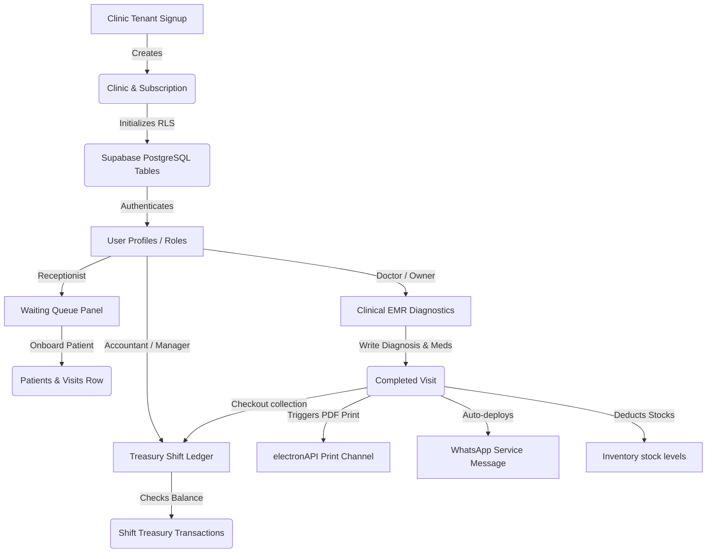

# Module 13: Logical Knowledge Graph

The EMR SaaS Clinic OS dataflows and relationship graphs can be mapped as follow:

## Key Integration Nodes
* **Meta & WaSender API hooks** link EMR visit completion actions to client endpoints.
* **WebSocket listener** links inventory quantities to system alerts.

---
## RAG Optimization Details
* **Tags:** #MermaidDiagram #KnowledgeGraph #EntitiesMapping #WorkflowsGraph
* **Linked files:** [01_system_overview.md](file:///d:/AHMED/Managments%20Projects%20-%20%D9%86%D8%B8%D9%85%20%D8%A7%D8%AF%D8%A7%D8%B1%D8%A9%20%D8%A7%D9%84%D9%85%D8%B4%D8%A7%D8%B1%D9%8A%D8%B9/Clinic%20manager%20-%20%D9%85%D8%AF%D9%8A%D8%B1%20%D8%A7%D9%84%D8%B9%D9%8A%D8%A7%D8%AF%D8%A9%202/knowledge_base/01_system_overview.md)
